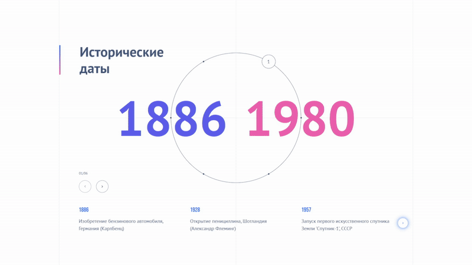

### My name is Aleksand. I am a frontend developer.

  

### My tech stack

---

  &nbsp;
  &nbsp;
  &nbsp;
  &nbsp;
  &nbsp;
  &nbsp;
  &nbsp;
  &nbsp;
  &nbsp;
  &nbsp;
  &nbsp;
  &nbsp;
  &nbsp;
  &nbsp;
  &nbsp;

#### Frontend

...

#### Backend

...

#### Database

### My projects

---

####  1. Test task from Only

Исходный код проекта: <a href="https://github.com/bumbu5571/test_task/tree/dev">https://github.com/bumbu5571/test_task/tree/dev</a>

Демо-версия: <a href="https://bumbu5571.github.io/test_task/">https://bumbu5571.github.io/test_task/</a>

  
  

####  2. GreenMind - веб-платформа, объединяющая пользователей и бизнес в целях устойчивого развития и охраны окружающей среды.

Исходный код проекта: <a href="https://github.com/bumbu5571/GreenMind">https://github.com/bumbu5571/GreenMind</a>

   
   

#### 3. Bookworm - Онлайн библиотека

Исходный код проекта: <a href="https://github.com/bumbu5571/Bookworm">https://github.com/bumbu5571/Bookworm</a>

    
    

#### 4. Three.js, React + TS + Vite / demo weapon tarkov

Исходный код проекта: <a href="https://github.com/bumbu5571/demoTarkov/tree/main">https://github.com/bumbu5571/demoTarkov/tree/main</a>

Демо-версия: <a href="https://bumbu5571.github.io/demoTarkov/">https://bumbu5571.github.io/demoTarkov/</a>

